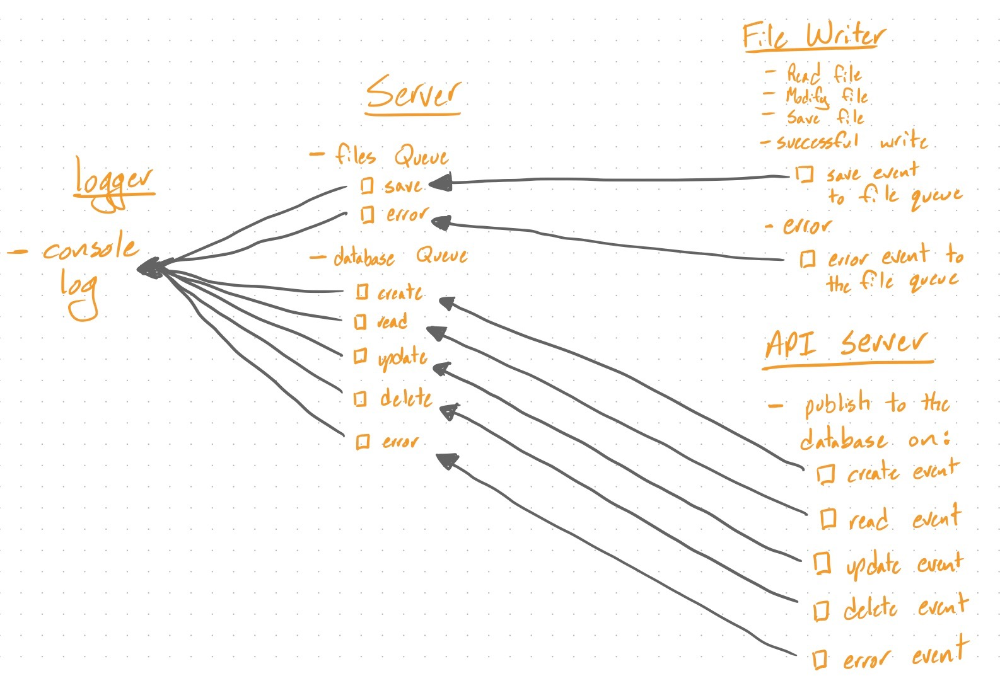

 LAB 19
=================================================

## Message Queue and Logger

### Author: Jagdeep Singh

### Links and Resources
* [submission PR](https://github.com/401-advanced-javascript-js/lab-19-message-queue-server-and-logger/pull/1)

#### Documentation
* [api docs](http://xyz.com) (API servers)
* [jsdoc](http://xyz.com) (Server assignments)

### Setup
#### `.env` requirements
* `LOGGER_PORT` - Port Number for logger
* `PORT` - Port for server, different from above logger port
* `QUEUE_SERVER` - Full URL and PORT of your running queue server

#### Running the app
* `npm start`
* `nodemon `

#### UML

